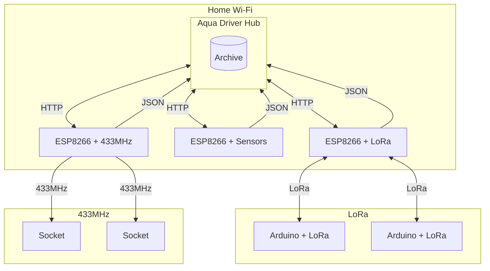

# DIAGRAM

# Configuration

## GIT:
- git rm -rf --cached .
- git add .
- git status
- gh repo clone gibonson/AuqaDriver
- cd /home/gibon/www/AuqaDriver/AuqaDriver
- git stash
- gh repo sync
- ln /home/gibon/www/AuqaDriver/userFiles/db.sqlite /home/gibon/www/AuqaDriver/AuqaDriver/- userFiles/
- ln /home/gibon/www/AuqaDriver/userFiles/config_email.ini /home/gibon/www/AuqaDriver/AuqaDriver/userFiles/

## VIRTUAL ENV:
- virtualenv venv/
- source ./venv/bin/activate

## DOCKER:
- sudo docker build . -t ptapp
- sudo docker run -v $(pwd):/usr/src/app -d --restart=always --name aquadriver -p 5000:5000 ptapp 

## JSON EXAMPLE:

{
"addInfo": "BD creation",
"deviceName":"Server",
"deviceIP":"127.0.0.1",
"type":"Alert",
"value":10
}

## TO DO:
 - add API https://danepubliczne.imgw.pl/apiinfo