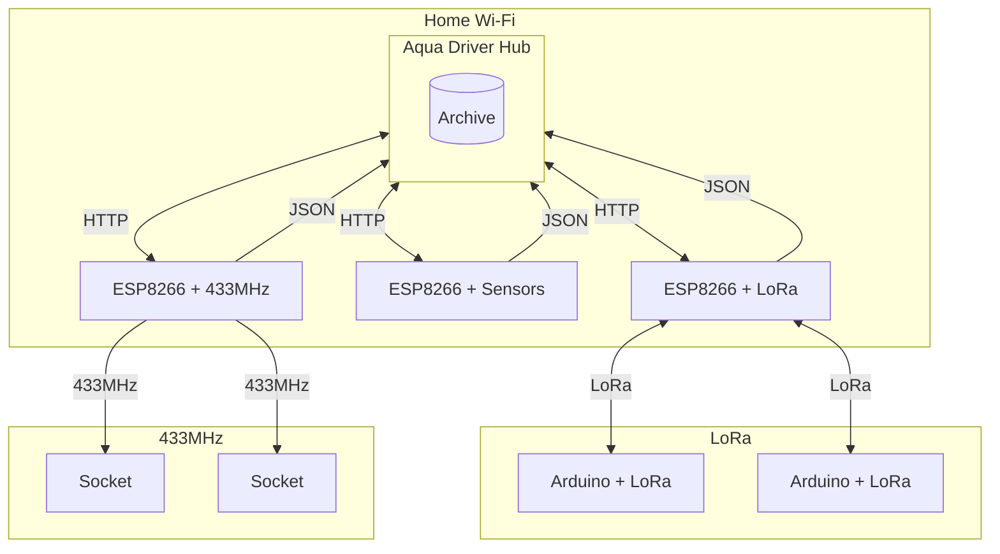

# AQUADRIVER

## DESCRIPTION

AquaDriver is an application designed for managing simple automation, allowing easy control of devices in a home or office environment. It runs on the Flask platform in a Linux environment with Docker, ensuring high flexibility and reliability.
The application enables communication with devices such as ESP and Arduino through the LAN network, allowing for automated scheduling of light switching, socket control, and sensor data reading. With these features, you can remotely control your devices and monitor the status of various systems in real time.
AquaDriver also offers the ability to notify users of important events via email, ensuring full control over automation processes even when you don't have direct access to the application. Additionally, the application allows for generating simple reports that help with analysis and documentation of activities.

## TECHNOLOGY

1. Linux – Operating System
    - Provides a stable and reliable environment for running applications, especially when combined with Docker, offering great configuration flexibility.

1. Docker – Isolation and Containerization
    - Allows the application to run in containers, providing flexibility, easy deployment, and environmental isolation, enhancing performance and security.

1. Python – Programming Language
    - Used for building the backend logic of the application, managing data, and automating processes.

1. Flask – Web Framework (Python)
    - Handles HTTP routing and JSON support for communication with devices and APIs.

1. APScheduler – Task Scheduling Library
    - Used to plan and manage cyclic tasks, such as scheduled switching on and off of devices, data retrieval, and monitoring device statuses.

1. ESP & Arduino – IoT Devices
    - Programmed using Arduino IDE and C/C++.
    - Supports various modules, such as sensors, communication modules (Wi-Fi, Bluetooth), and control devices (relays, motors), allowing customization and expansion of the automation system.

1. SQLite – Database
    - A lightweight, local database used for storing device configurations, event histories, and other application data, ensuring quick data ccess.

1. Web Interface – Web Interface
    - Allows management of devices and configuration of the application through a web browser, offering a simple and intuitive user interface.

1. Bootstrap – Framework for Responsive User Interfaces
    - Used to create aesthetically pleasing, responsive, and user-friendly web interfaces that adjust to different devices and screen resolutions.

## DIAGRAM

## Configuration

### GIT

- git rm -rf --cached .
- git add .
- git status
- gh repo clone gibonson/AuqaDriver
- cd /home/gibon/www/AuqaDriver/AuqaDriver
- git stash
- gh repo sync
- ln /home/gibon/www/AuqaDriver/userFiles/db.sqlite /home/gibon/www/AuqaDriver/AuqaDriver/- userFiles/
- ln /home/gibon/www/AuqaDriver/userFiles/config_email.ini /home/gibon/www/AuqaDriver/AuqaDriver/userFiles/

### VIRTUAL ENV

- virtualenv venv/
- source ./venv/bin/activate

### DOCKER

- sudo docker build . -t ptapp
- sudo docker run -v $(pwd):/usr/src/app -d --restart=always --name aquadriver -p 5000:5000 ptapp 

### JSON EXAMPLE

{
"addInfo": "BD creation",
"deviceName":"Server",
"deviceIP":"127.0.0.1",
"type":"Alert",
"value":10
}

### TO DO

- add API https://danepubliczne.imgw.pl/apiinfo